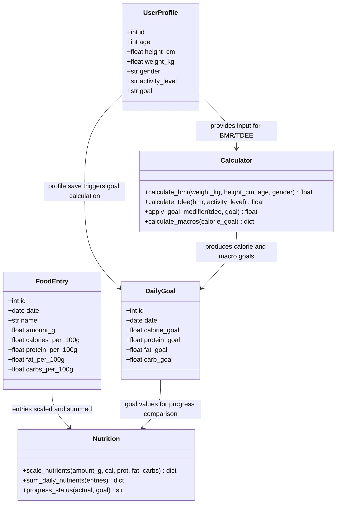
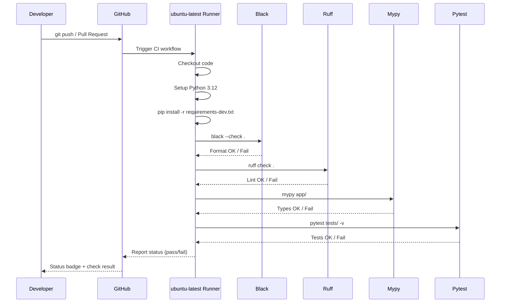

<objective>
Create the GitHub Actions CI pipeline and mandatory diagrams.

Purpose: QUAL-03 requires a CI pipeline running Black, Ruff, Mypy, and pytest on push/PR. QUAL-04 requires a Klassendiagramm. QUAL-05 requires a Sequenzdiagramm of the CI/CD pipeline. These are mandatory submission artefacts.
Output: .github/workflows/ci.yml, docs/klassendiagramm.mmd, docs/sequenzdiagramm-ci.mmd, requirements-dev.txt
</objective>

<execution_context>
@$HOME/.claude/get-shit-done/workflows/execute-plan.md
@$HOME/.claude/get-shit-done/templates/summary.md
</execution_context>

<context>
@.planning/PROJECT.md
@.planning/ROADMAP.md
@.planning/STATE.md

@pyproject.toml
@requirements.txt
@app/models.py
@app/calculator.py
@app/nutrition.py
@app/forms.py
</context>

<interfaces>
<!-- Models for Klassendiagramm -->

From app/models.py:
```python
class UserProfile(db.Model):
    id: Mapped[int]
    age: Mapped[int]
    height_cm: Mapped[float]
    weight_kg: Mapped[float]
    gender: Mapped[str]
    activity_level: Mapped[str]
    goal: Mapped[str]

class DailyGoal(db.Model):
    id: Mapped[int]
    date: Mapped[date]
    calorie_goal: Mapped[float]
    protein_goal: Mapped[float]
    fat_goal: Mapped[float]
    carb_goal: Mapped[float]

class FoodEntry(db.Model):
    id: Mapped[int]
    date: Mapped[date]
    name: Mapped[str]
    amount_g: Mapped[float]
    calories_per_100g: Mapped[float]
    protein_per_100g: Mapped[float]
    fat_per_100g: Mapped[float]
    carbs_per_100g: Mapped[float]
```

From pyproject.toml (QA config):
```toml
[tool.black]
line-length = 88

[tool.ruff]
line-length = 88
select = ["E", "F", "I", "W"]

[tool.mypy]
ignore_missing_imports = true
disallow_untyped_defs = true
```
</interfaces>

<tasks>

<task type="auto">
  <name>Task 1: Create requirements-dev.txt and GitHub Actions CI workflow</name>
  <files>requirements-dev.txt, .github/workflows/ci.yml</files>
  <read_first>requirements.txt, pyproject.toml</read_first>
  <action>
1. Create `requirements-dev.txt` with exact content:
```
-r requirements.txt
pytest==9.0.2
pytest-flask==1.3.0
black==26.3.1
ruff==0.15.7
mypy==1.19.1
```

2. Create `.github/workflows/ci.yml` with exact content:
```yaml
name: CI

on:
  push:
    branches: [main]
  pull_request:
    branches: [main]

jobs:
  quality:
    runs-on: ubuntu-latest

    steps:
      - uses: actions/checkout@v4

      - name: Set up Python
        uses: actions/setup-python@v5
        with:
          python-version: "3.12"

      - name: Install dependencies
        run: |
          python -m pip install --upgrade pip
          pip install -r requirements-dev.txt

      - name: Format check (Black)
        run: black --check .

      - name: Lint (Ruff)
        run: ruff check .

      - name: Type check (Mypy)
        run: mypy app/

      - name: Test (pytest)
        run: pytest tests/ -v --tb=short
```

The steps MUST run in this exact order per CLAUDE.md: Black -> Ruff -> Mypy -> pytest. Each step is separate so a failure pinpoints which check failed. The job is named "quality" (single job, sequential steps).
  </action>
  <verify>
    <automated>cd C:/Repos/NutriTrack && cat .github/workflows/ci.yml | grep -c "black\|ruff\|mypy\|pytest"</automated>
  </verify>
  <acceptance_criteria>
    - requirements-dev.txt contains `-r requirements.txt`
    - requirements-dev.txt contains `pytest==9.0.2`
    - requirements-dev.txt contains `black==26.3.1`
    - requirements-dev.txt contains `ruff==0.15.7`
    - requirements-dev.txt contains `mypy==1.19.1`
    - .github/workflows/ci.yml contains `name: CI`
    - .github/workflows/ci.yml contains `black --check .`
    - .github/workflows/ci.yml contains `ruff check .`
    - .github/workflows/ci.yml contains `mypy app/`
    - .github/workflows/ci.yml contains `pytest tests/ -v --tb=short`
    - .github/workflows/ci.yml contains `python-version: "3.12"`
    - .github/workflows/ci.yml contains `requirements-dev.txt`
    - Black step appears BEFORE Ruff step, Ruff BEFORE Mypy, Mypy BEFORE pytest
  </acceptance_criteria>
  <done>CI workflow file exists with all 4 QA steps in correct order; requirements-dev.txt lists all dev dependencies with pinned versions</done>
</task>

<task type="auto">
  <name>Task 2: Create Klassendiagramm and Sequenzdiagramm as Mermaid files</name>
  <files>docs/klassendiagramm.mmd, docs/sequenzdiagramm-ci.mmd</files>
  <read_first>app/models.py, app/calculator.py, app/nutrition.py, app/forms.py, .github/workflows/ci.yml</read_first>
  <action>
Create `docs/` directory if it does not exist.

1. Create `docs/klassendiagramm.mmd` — a Mermaid class diagram showing application models, their attributes, types, and the key business logic modules. Must reflect ACTUAL code, not theoretical design.

Content:


2. Create `docs/sequenzdiagramm-ci.mmd` — a Mermaid sequence diagram showing the CI/CD pipeline flow when a developer pushes a commit.

Content:


Both files must use `.mmd` extension (Mermaid markdown). GitHub renders these natively in file preview and in README embeds.
  </action>
  <verify>
    <automated>cd C:/Repos/NutriTrack && test -f docs/klassendiagramm.mmd && test -f docs/sequenzdiagramm-ci.mmd && grep -c "classDiagram" docs/klassendiagramm.mmd && grep -c "sequenceDiagram" docs/sequenzdiagramm-ci.mmd</automated>
  </verify>
  <acceptance_criteria>
    - docs/klassendiagramm.mmd contains `classDiagram`
    - docs/klassendiagramm.mmd contains `class UserProfile`
    - docs/klassendiagramm.mmd contains `class DailyGoal`
    - docs/klassendiagramm.mmd contains `class FoodEntry`
    - docs/klassendiagramm.mmd contains `class Calculator`
    - docs/klassendiagramm.mmd contains `class Nutrition`
    - docs/klassendiagramm.mmd contains `calculate_bmr`
    - docs/sequenzdiagramm-ci.mmd contains `sequenceDiagram`
    - docs/sequenzdiagramm-ci.mmd contains `Black`
    - docs/sequenzdiagramm-ci.mmd contains `Ruff`
    - docs/sequenzdiagramm-ci.mmd contains `Mypy`
    - docs/sequenzdiagramm-ci.mmd contains `Pytest`
    - docs/sequenzdiagramm-ci.mmd contains `git push`
  </acceptance_criteria>
  <done>Both diagrams exist as committed Mermaid files reflecting actual application structure and CI pipeline</done>
</task>

</tasks>

<verification>
- `.github/workflows/ci.yml` exists and contains all 4 QA tool steps
- `docs/klassendiagramm.mmd` exists and contains all 3 models + 2 business logic classes
- `docs/sequenzdiagramm-ci.mmd` exists and contains the full CI pipeline sequence
- `requirements-dev.txt` exists and includes all QA tools with pinned versions
- Locally run: `black --check .` passes, `ruff check .` passes, `mypy app/` passes, `pytest tests/ -v` passes
</verification>

<success_criteria>
- QUAL-03: CI workflow file with Black -> Ruff -> Mypy -> pytest pipeline on push/PR to main
- QUAL-04: Klassendiagramm as Mermaid file showing UserProfile, DailyGoal, FoodEntry, Calculator, Nutrition
- QUAL-05: Sequenzdiagramm as Mermaid file showing CI pipeline flow from push to status report
- All QA tools pass locally before CI is triggered
</success_criteria>

<output>
After completion, create `.planning/phases/03-quality-gates/03-03-SUMMARY.md`
</output>
